# 💙 LoveYou (Evolução do Projeto 04-11)

> Um aplicativo mobile Android exclusivo criado para celebrar o amor, resgatar memórias e acabar com a indecisão na hora de escolher os roteiros de encontros do casal.

## 🚀 O Contexto: Uma História de Evolução

O **LoveYou** é a refatoração completa e a evolução direta do meu projeto anterior, o [04-11](https://github.com/CFSC3/04-11). 

Decidi manter o repositório original intacto como um dos marcos do meu início na programação. Este novo repositório, por sua vez, reflete o meu amadurecimento profissional como Desenvolvedor de Software. O foco desta refatoração foi transformar um "projeto de início" em uma aplicação com qualidade de mercado, aplicando conceitos sólidos de **UI/UX**, **Clean Code**, consumo inteligente de dados em nuvem e tratamento de exceções.

## ✨ O Que Mudou? (Destaques da Refatoração)

A transição do *04-11* para o *LoveYou* contou com melhorias profundas em quatro pilares principais:

### 1. UI/UX e Identidade Visual
* **Minimalismo e Contraste:** Substituição de longos textos explicativos por descrições curtas e diretas, melhorando a escaneabilidade.
* **Navegação Dinâmica:** Implementação de transição de cores e ocultação dinâmica dos ícones do *BottomNavigationView* durante o *Onboarding*, focando a atenção do usuário.
* **Feedback Visual:** Adição de elevação (`elevation`) e efeito cascata (`ripple effect / foreground`) nos botões para uma resposta tátil e visual imersiva.
* **Máscaras de Input:** Implementação de `TextWatcher` para formatação automática de datas (DD/MM/AAAA) nativa no padrão brasileiro, melhorando a experiência do cadastro.

### 2. Otimização de Backend (Firebase)
* **Conteúdo 100% Dinâmico:** A lógica de sorteio de vales, frases e mídias deixou de ter limites fixos no código. Agora, o app utiliza `getChildrenCount()` para ler dinamicamente o total de nós no Realtime Database. 
* **Zero Manutenção de Código para Novo Conteúdo:** Novas músicas e imagens podem ser adicionadas diretamente pelo console do Firebase e já aparecem no app do usuário final sem necessidade de recompilar a aplicação.
* **Requisições Eficientes:** Migração de ouvintes contínuos (`addValueEventListener`) para leituras únicas (`addListenerForSingleValueEvent`), economizando banda e memória.

### 3. Arquitetura e Estabilidade
* **Monitoramento de Rede em Tempo Real:** Criação de uma classe utilitária de *BroadcastReceiver* para pausar e retomar funcionalidades do app automaticamente caso o dispositivo perca a conexão com a internet, evitando crashes (NullPointerExceptions).
* **Migração para ExoPlayer:** Substituição do `MediaPlayer` padrão pelo `ExoPlayer` da Google, permitindo a leitura e reprodução simultânea de áudio e GIFs em loop diretamente de URLs em nuvem, de forma otimizada.
* **Integração com Apps Terceiros:** Envio de "Tickets" via Intents nativas para WhatsApp e Telegram, utilizando `Uri.encode` para garantir a integridade de emojis e caracteres especiais nas mensagens.

* ### 4. Redesign Completo do Player de Música
* **Mídias Imersivas (Gifs Animados):** A tela "Sons e Sentimentos" foi totalmente reescrita para suportar GIFs dinâmicos renderizados como plano de fundo, criando uma experiência visual rica e imersiva.
* **Contador de Tempo Real:** Criação e sincronização de uma Thread dedicada para atualizar a barra de progresso (`SeekBar`) e mostrar o tempo exato (atual e restante) da música, entregando o controle visual que faltava na versão anterior.
* **Nova Identidade das Mídias:** Adição de novas personalidades visuais na tela de reprodução para acompanhar as músicas sorteáveis, unindo perfeitamente a frase, a arte animada e o áudio.

## 📱 Funcionalidades

* **Sons e Sentimentos:** Um player imersivo que sorteia músicas significativas para o usuário juntamente com artes/gifs animados e frases românticas.
* **Tickets Especiais:** Um sistema de "vales" surpresa (ex: "Vale um lanche especial") que o usuário pode sortear e enviar automaticamente pelo WhatsApp ou Telegram para pessoa amada.
* **Lembranças e Momentos:** Uma integração com a API do Google Maps para revisitar restaurantes, passeios favoritos e descobrir novos destinos usando o botão de sorteio de rotas.

## 📸 Screenshots

  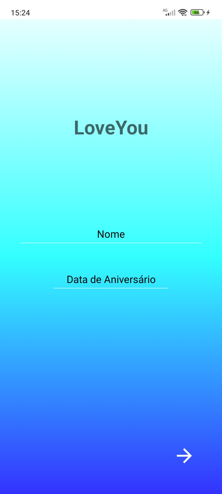
  &nbsp;
  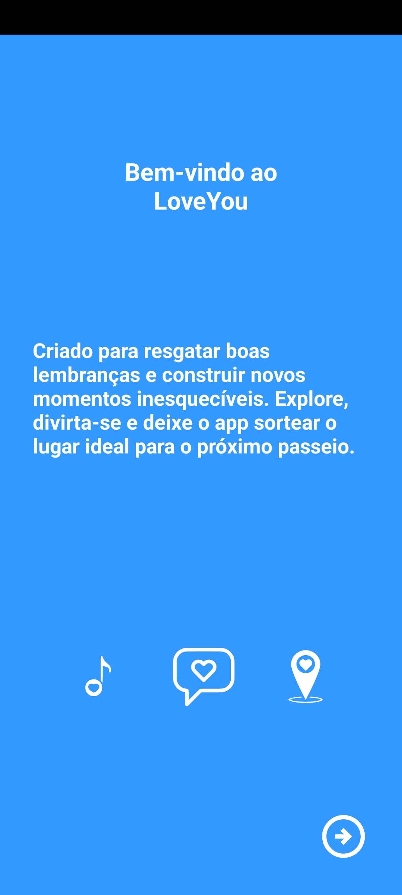
  &nbsp;
  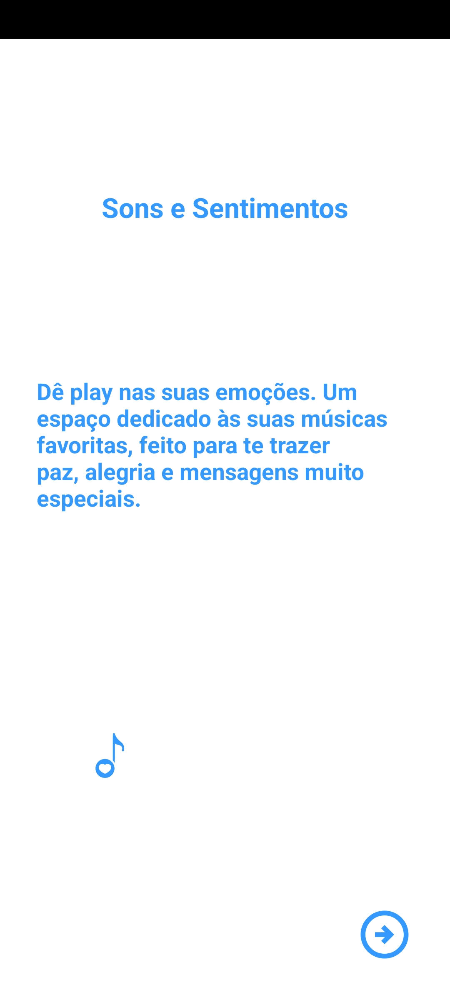
  &nbsp;
  
  &nbsp;
  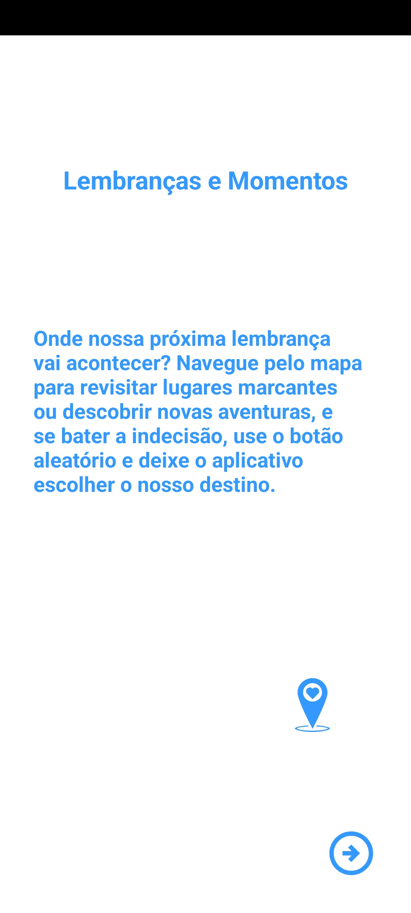
  &nbsp;
  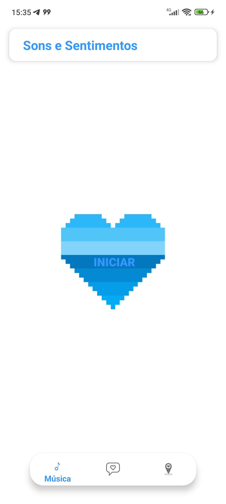
  &nbsp;
  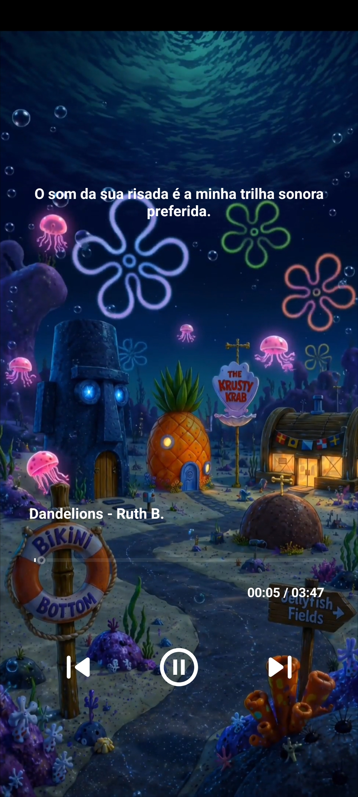
  &nbsp;
  <video src="img/videoMusica.mp4" width="220" controls></video>
  &nbsp;
  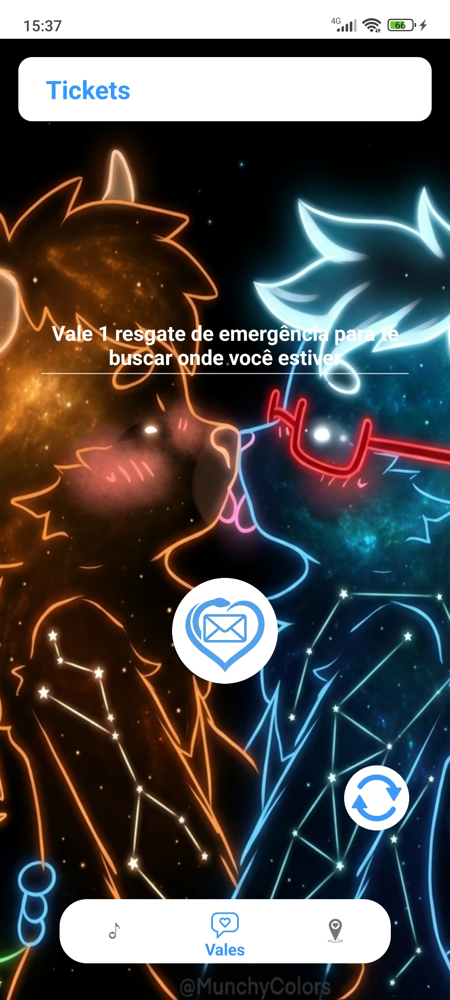
  &nbsp;
  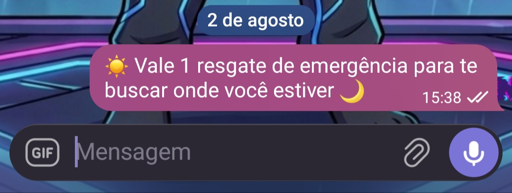
  &nbsp;
  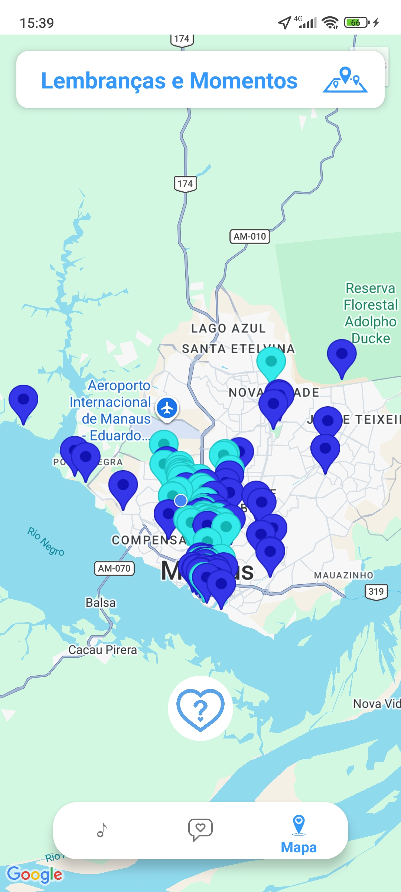
  &nbsp;
  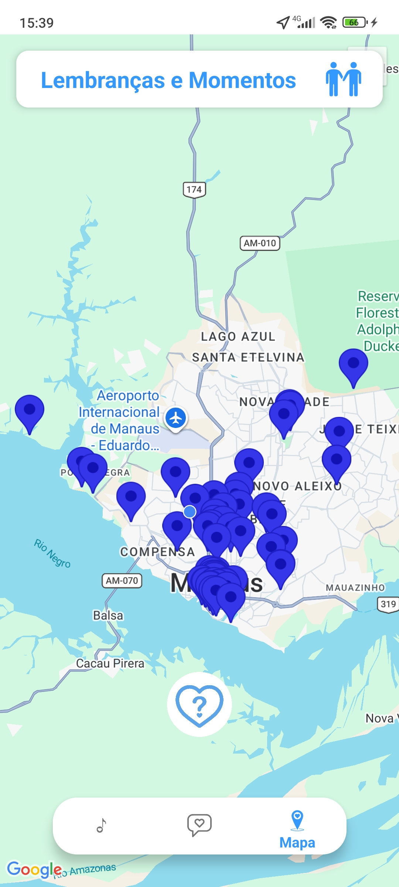
  &nbsp;
  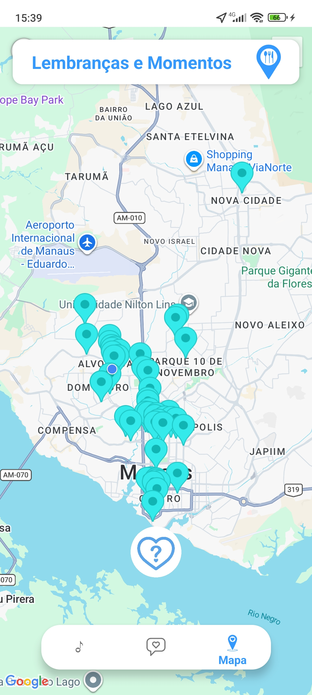
  &nbsp;
  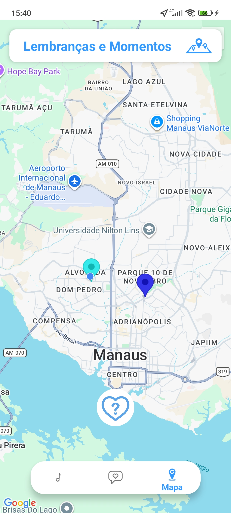

## 🛠️ Tecnologias Utilizadas

* **Linguagem:** Java
* **IDE:** Android Studio
* **Cloud & BaaS:** Firebase (Authentication, Realtime Database)
* **Mídia:** ExoPlayer
* **Mapas:** Google Maps SDK for Android

## 👨‍💻 Autor

**Carlos Felipe Souza Carvalho**
Estudante de Análise e Desenvolvimento de Sistemas (Senac) apaixonado por engenharia de software, qualidade e desenvolvimento de soluções criativas.

* **LinkedIn:** [Acesse meu perfil](https://www.linkedin.com/in/carlos-felipe-souza-carvalho/)
* **E-mail:** carlosfelipesouzacarvalho@gmail.com

---
*Feito com 💙 e muito café.*
